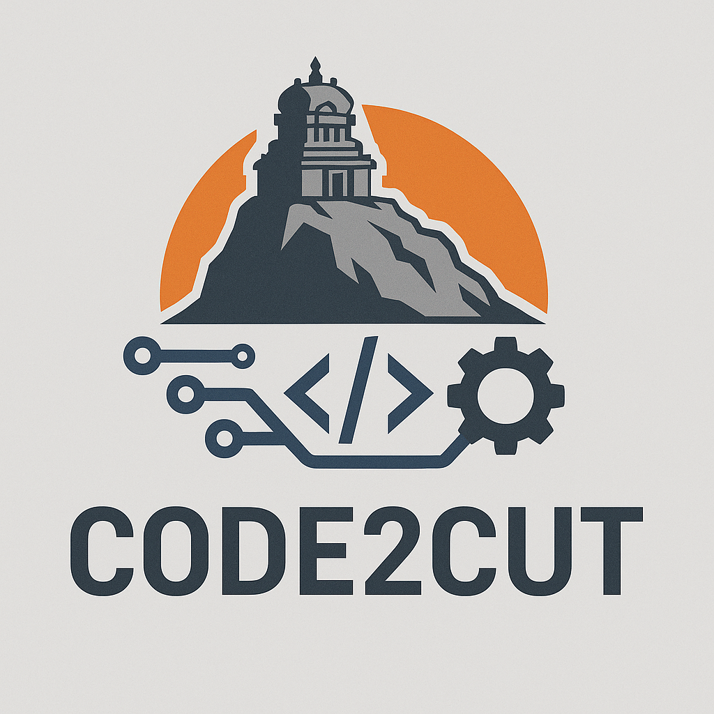

# Code2Cut  
We turn your code into precise cuts. From digital design to real-world build — fast, clean, and smart.

---

## 📘 Project Flowchart (Basic Steps)

### Index  
1. [Idea / Problem](#1-idea--problem)  
2. [Research & Plan](#2-research--plan)  
3. [Design (Hardware/Software)](#3-design-hardwaresoftware)  
4. [Build Prototype](#4-build-prototype)  
5. [Test & Debug](#5-test--debug)  
6. [Improve / Optimize](#6-improve--optimize)  
7. [Finalize & Document](#7-finalize--document)  
8. [Share or Deploy](#8-share-or-deploy)

---

## 1. Idea / Problem  
Start with identifying a problem or a need — what should your CNC machine solve or do?

## 2. Research & Plan  
Study existing solutions, define goals, list needed tools/components, and outline steps.

## 3. Design (Hardware/Software)  
Create digital models (CAD), circuit diagrams, and write control software or firmware.

## 4. Build Prototype  
Assemble the machine using available materials. It's okay if it's rough — it’s just a start.

## 5. Test & Debug  
Run basic operations. Fix wiring, software bugs, mechanical alignment, or unexpected behavior.

## 6. Improve / Optimize  
Make improvements for speed, accuracy, usability, or safety based on testing results.

## 7. Finalize & Document  
Polish the build, clean up the code, and write documentation (manual, BOM, wiring diagrams).

## 8. Share or Deploy  
Deploy your machine in real-world use — or share your design/code online for others to use.

---
